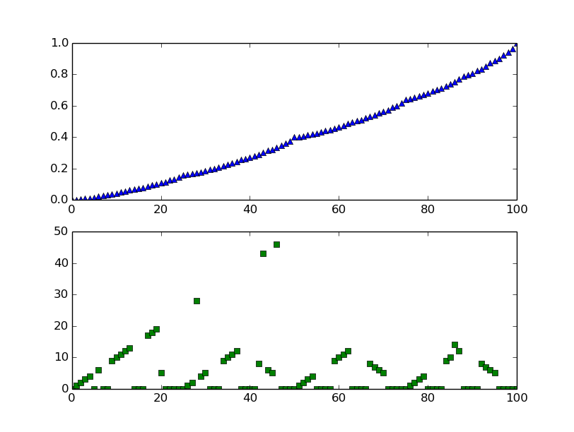

### Examle 4.3

This example uses the "Value Iteration" algorithm to compute the optimal policies and the optimal state values of the Gambler's Problem.

Experiments with this implementation proved that there are always a number of best actions for each state during the iterations. The values of the states calculated by taking those actions are equal. If you plot all of the tied best actions you will get a plotting like the one by @datahaki (https://github.com/idsc-frazzoli/subare)
## 
#### Plotting after 20 Iterations of Policy Evaluation

